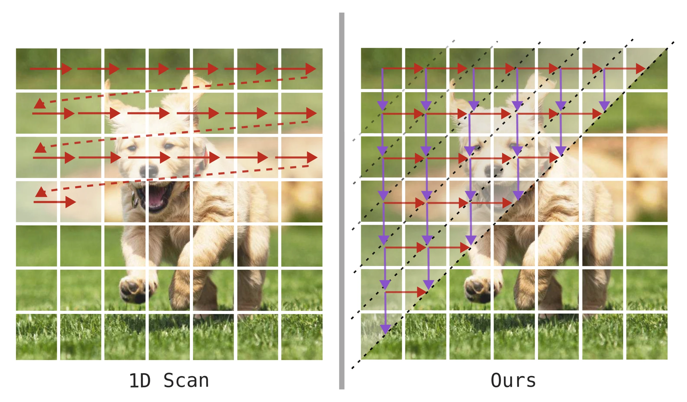
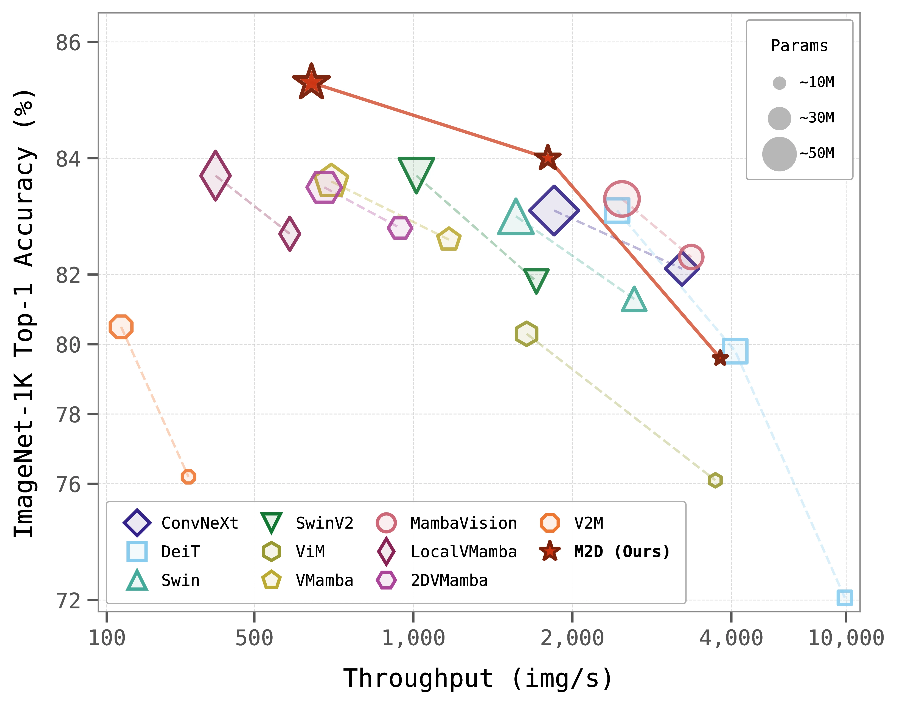
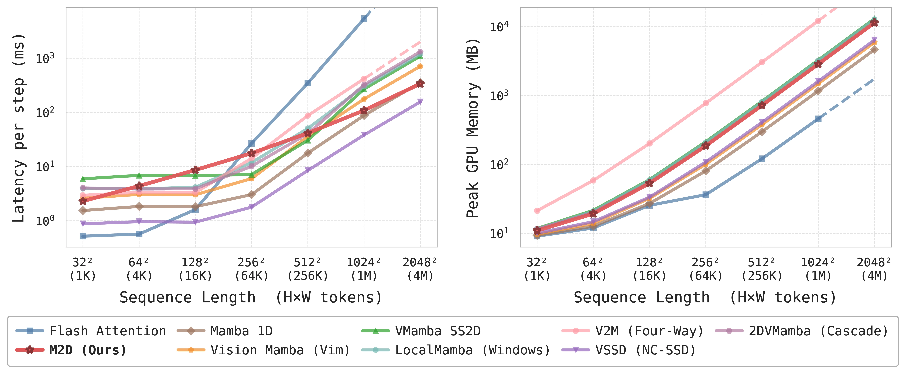

<div align="center">
<h1>Mamba2D </h1>
<h3>A Natively Multi-Dimensional State-Space Model for Vision Tasks</h3>

[Enis Baty](https://scholar.google.co.uk/citations?user=SYOXFuoAAAAJ)<sup>1</sup> \*, [Alejandro Hernández Díaz](https://scholar.google.es/citations?user=C0baOcEAAAAJ&hl=es)<sup>1</sup> \*, [Rebecca Davidson](https://scholar.google.es/citations?user=WT4Xq1UAAAAJ&hl=es)<sup>2</sup>, [Chris Bridges](https://scholar.google.es/citations?user=iySVX8MAAAAJ&hl=es)<sup>1</sup>, [Simon Hadfield](https://scholar.google.es/citations?user=KuQs_N0AAAAJ&hl=es)<sup>1</sup>

<sup>1</sup>  University of Surrey, <sup>2</sup>  Surrey Satellite Technology Ltd

(\*) Joint first authorship

 ArXiv Preprint ([arXiv 2412.16146](https://arxiv.org/abs/2412.16146))

</div>

## Updates
- `2026-03-18`: Updated codebase and results
  - Updated CUDA wavefront kernel with partial recomputation, reducing peak VRAM by ~81% and forward+backward wall time by ~37% vs. prior implementation
  - Improved classification results on ImageNet-1K
  - Added MS-COCO detection and ADE20K segmentation results
  - Released pretrained weights for all model sizes (N/T/S) across classification, detection, and segmentation, available [here](https://github.com/cocoalex00/Mamba2D/releases/tag/v2.0.0)
- `2025-04-17`: Released pretrained weights for M2D-T available [here](https://github.com/cocoalex00/Mamba2D/releases/tag/v1.0.0).

## Introduction
State-Space Models (SSMs) have emerged as an efficient alternative to transformers, yet existing visual SSMs retain deeply ingrained biases from their origins in natural language processing. We address these limitations by introducing M2D-SSM, a ground-up re-derivation of selective state-space techniques for multidimensional data. Unlike prior works that apply 1D SSMs directly to images through arbitrary rasterised scanning, our M2D-SSM employs a single 2D scan that factors in both spatial dimensions natively.

<div align="center">

</div>

We achieve state-of-the-art speed and accuracy across a range of tasks and model sizes. On ImageNet-1K classification, M2D-T achieves 84.0% top-1 accuracy with only 27M parameters, surpassing all prior SSM-based vision models at that size. M2D-S further achieves 85.3%, establishing state-of-the-art among SSM-based architectures. Across downstream tasks, Mamba2D achieves 52.2 box AP on MS-COCO object detection (3× schedule) and 51.7 mIoU on ADE20K segmentation, demonstrating strong generalisation and efficiency at scale.

<div align="center">

</div>

*M2D (★) establishes a new accuracy–throughput–params frontier for SSM vision models.*

## Overview

<div align="center">

</div>

Mamba2D model architecture. A convolutional stem performs patch embedding, followed by four stages of feature extraction. Each stage consists of N blocks, comprising a token mixer and an FFN. The Mamba2D token mixer uses two parallel branches: our native 2D SSM path and a local processing path, whose outputs are combined before the FFN.

---

<div align="center">

</div>

Kernel-level scaling of nine token-mixing operators across spatial resolutions (32²–2048²). M2D scales sub-linearly in latency (O(N^0.56)) due to the wavefront's diagonal-depth growth. At 1024² it is ~50× faster than Flash Attention, ~2.5× faster than VMamba SS2D, and ~4× faster than V2M, while maintaining linear memory scaling. Left: forward-pass latency (ms, log scale). Right: peak GPU memory (MB, log scale).

---

## Installation

```bash
uv venv .venv && source .venv/bin/activate
uv pip install -r requirements.txt
```

## Datasets

### ImageNet
Download the ImageNet-1K (2012) dataset from [image-net.org](http://image-net.org/). The expected directory structure is:

```
imagenet
├── TrainingSet
│   ├── n01440764
│   │   ├── n01440764_18.JPEG
│   │   └── ...
│   └── ...
└── ValidationSet
    ├── ILSVRC2012_val_00000001.JPEG
    └── ...
```

## Training

Set the ImageNet path in `data.init_args.data_dir` within the config, then run:

```bash
# Sanity check (single batch)
python main.py fit -c configs/M2D-T-ImageNet.yaml --trainer.fast_dev_run true

# Train
python main.py fit -c configs/M2D-T-ImageNet.yaml
```

## Evaluation

```bash
python main.py validate -c configs/M2D-T-ImageNet.yaml --ckpt_path pretrained/M2D-T-backbone.ckpt
```

## Downstream Tasks

Detection and segmentation configs and integration code are provided in [`downstream/`](downstream/README.md). The setup is designed for drop-in use with existing MMDetection and MMSegmentation installations — copy the `Mamba2D/` backbone package and the relevant configs into your mm* project directory, then train or evaluate as normal. Configs are provided for all three model sizes across both Mask R-CNN (COCO) and UperNet (ADE20K). See [`downstream/README.md`](downstream/README.md) for full setup instructions.

## Results & Pretrained Checkpoints

### ImageNet-1K Classification

| Model | Params | Blocks | Channels | Top-1 (%) | Checkpoint |
|-------|--------|--------|----------|-----------|------------|
| M2D-N | 7M | [3,3,9,3] | [32,64,160,256] | 79.6 | [M2D-N-backbone.ckpt](https://github.com/cocoalex00/Mamba2D/releases/download/v2.0.0/M2D-N-backbone.ckpt) |
| M2D-T | 27M | [3,3,9,3] | [64,128,320,512] | 84.0 | [M2D-T-backbone.ckpt](https://github.com/cocoalex00/Mamba2D/releases/download/v2.0.0/M2D-T-backbone.ckpt) |
| M2D-S | 50M | [3,12,14,3] | [96,192,384,576] | 85.3 | [M2D-S-backbone.ckpt](https://github.com/cocoalex00/Mamba2D/releases/download/v2.0.0/M2D-S-backbone.ckpt) |

### MS-COCO Object Detection & Instance Segmentation (Mask R-CNN, 1×)

| Model | Params | AP<sup>box</sup> | AP<sup>mask</sup> | Checkpoint |
|-------|--------|--------|---------|------------|
| M2D-N | 26M | 42.8 | 39.6 | [M2D-N-mask-rcnn-1x.pth](https://github.com/cocoalex00/Mamba2D/releases/download/v2.0.0/M2D-N-mask-rcnn-1x.pth) |
| M2D-T | 44M | 48.5 | 43.8 | [M2D-T-mask-rcnn-1x.pth](https://github.com/cocoalex00/Mamba2D/releases/download/v2.0.0/M2D-T-mask-rcnn-1x.pth) |
| M2D-S | 67M | 50.4 | 45.1 | [M2D-S-mask-rcnn-1x.pth](https://github.com/cocoalex00/Mamba2D/releases/download/v2.0.0/M2D-S-mask-rcnn-1x.pth) |

### MS-COCO Object Detection & Instance Segmentation (Mask R-CNN, 3×)

| Model | Params | AP<sup>box</sup> | AP<sup>mask</sup> | Checkpoint |
|-------|--------|--------|---------|------------|
| M2D-N | 26M | 47.2 | 42.4 | [M2D-N-mask-rcnn-3x.pth](https://github.com/cocoalex00/Mamba2D/releases/download/v2.0.0/M2D-N-mask-rcnn-3x.pth) |
| M2D-T | 44M | 50.5 | 44.7 | [M2D-T-mask-rcnn-3x.pth](https://github.com/cocoalex00/Mamba2D/releases/download/v2.0.0/M2D-T-mask-rcnn-3x.pth) |
| M2D-S | 67M | 52.2 | 46.2 | [M2D-S-mask-rcnn-3x.pth](https://github.com/cocoalex00/Mamba2D/releases/download/v2.0.0/M2D-S-mask-rcnn-3x.pth) |

### ADE20K Semantic Segmentation (UperNet 160k)

| Model | Params | mIoU (SS) | mIoU (MS) | Checkpoint |
|-------|--------|-----------|-----------|------------|
| M2D-N | 34M | 43.1 | 43.1 | [M2D-N-upernet.pth](https://github.com/cocoalex00/Mamba2D/releases/download/v2.0.0/M2D-N-upernet.pth) |
| M2D-T | 53M | 48.9 | 49.3 | [M2D-T-upernet.pth](https://github.com/cocoalex00/Mamba2D/releases/download/v2.0.0/M2D-T-upernet.pth) |
| M2D-S | 77M | 51.7 | 51.8 | [M2D-S-upernet.pth](https://github.com/cocoalex00/Mamba2D/releases/download/v2.0.0/M2D-S-upernet.pth) |

## Citation
If Mamba2D is helpful for your research, please cite the following paper:

```
@misc{baty2026mamba2dnativelymultidimensionalstatespace,
      title={Mamba2D: A Natively Multi-Dimensional State-Space Model for Vision Tasks},
      author={Enis Baty and Alejandro Hernández Díaz and Rebecca Davidson and Chris Bridges and Simon Hadfield},
      year={2026},
      eprint={2412.16146},
      archivePrefix={arXiv},
      primaryClass={cs.CV},
      url={https://arxiv.org/abs/2412.16146},
}
```
